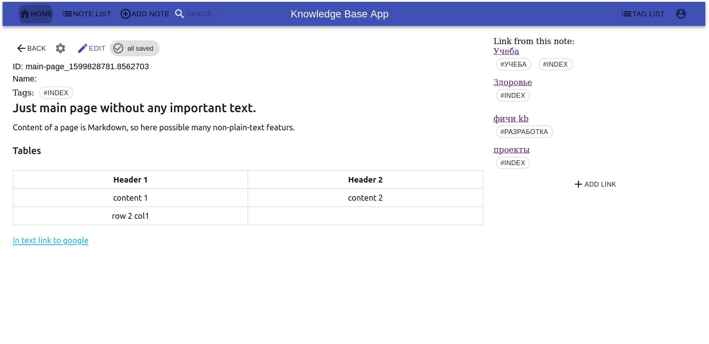

# KnowledgeBase

This project represents a web service for personal notes. The idea is inspired by Zettelkästen. 

 * Good russian description [link](https://habr.com/ru/post/508672/)
 * Good english description [link](https://zettelkasten.de/)

## Why is it helpful?

Actually provided links explain it in a much more detailed way. Just want to add that you will find this method helpful if you:
 * researcher or just creative person
 * have got a lot of ideas
 * want to store any reference information
 * bored from useless lists with ideas, that always lost

## App ability

With this application you can:
 * create Notes with markdown support
 * add tags to Notes
 * easily create links between notes 
 * search for specific tags, titles, and content of Notes 

Screen example:

## Technology

Backend: python 3.7
Frontend: React, Redux, Typescript
Integration: Docker, Nginx, Https (want to replace it by grpc), Postgres

created by [Martinson Michael](https://github.com/MartinsonMichael)

alpha version
